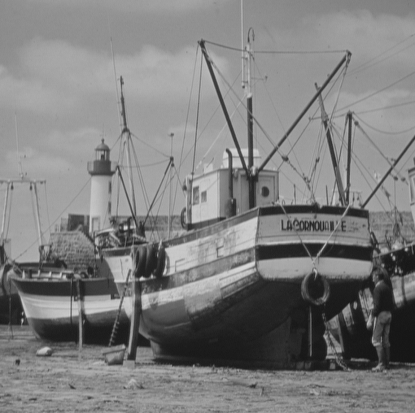
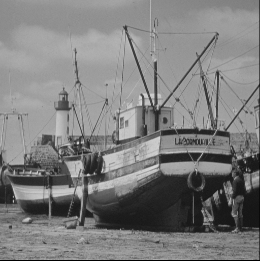
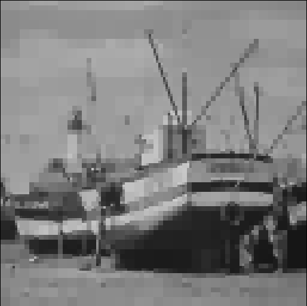

# QtreeComp - Compression d'images par QuadTree

Ce projet a été développé dans le cadre Programmation avancée en C à l'Université Gustave Eiffel à Paris. L'implémentation a été réalisée par Gonzalo Torras et Mario Lepage.

## Aperçu du projet

Ce projet met en œuvre un schéma de compression d'images hiérarchique basé sur la structure de données QuadTree. L'objectif principal est de compresser des images en niveaux de gris (format PGM) en exploitant la redondance spatiale et l'uniformité des blocs d'images.

## Fonctionnement du QuadTree

L'image est traitée comme une structure récursive :

1. **Division récursive** : L'image carrée est divisée en 4 quadrants égaux. Ce processus se répète pour chaque quadrant jusqu'à ce qu'un seul pixel soit atteint ou que le bloc soit "uniforme".
2. **Représentation des nœuds** : Chaque nœud dans le QuadTree stocke :
   * `m` (Moyenne) : La valeur moyenne de gris du bloc.
   * `e` (Erreur) : Le reste de la somme des enfants divisée par 4 (utilisé pour la reconstruction parfaite/sans perte).
   * `u` (Uniformité) : Un indicateur indiquant si le bloc est une feuille (uniforme) ou divisé en quatre enfants.
3. **Compression sans perte vs compression avec perte** :
   * **Sans perte** : Un bloc est marqué comme uniforme uniquement si tous ses pixels sont strictement identiques. Les valeurs `m` et `e` permettent de calculer les valeurs originales sans erreur.
   * **Avec perte** : Ce mode utilise la variance du bloc. Si la variance est inférieure à un seuil défini par le paramètre `alpha`, le bloc est forcé à être "uniforme", économisant de l'espace mais la qualité de l'image est réduite.
4. **Format QTC** : Les données sont compressées au niveau des bits (Bitstream) pour minimiser la taille finale du fichier, en utilisant uniquement le nombre nécessaire de bits pour chaque champ.

## Fonctionnalités

- Prise en charge de la compression et de la décompression d'images PGM (format binaire P5).
- Les images doivent être carrées, de dimensions \(2^n \times 2^n\).
- La compression peut être sans perte ou avec perte, selon les options choisies.
- La sortie est un fichier au format personnalisé `.qtc`.

## Utilisation
Il s’agit d’une image standard de 512×512 au format .png (GitHub n’affiche pas les fichiers .pgm) provenant du dossier PGM, en noir et blanc:



### Encodage Lossless (sans perte)
```sh
./codec -c -i ../../PGM/image.pgm -o sortie.qtc
```
Voici l’image au format .png (GitHub n’affiche pas les fichiers .pgm) après le codage sans perte:



### Encodage Lossy
```sh
./codec -c -i ../../PGM/image.pgm -o sortie.qtc -a 3.0
```
Voici l’image au format .png (GitHub n’affiche pas les fichiers .pgm) après le codage avec perte avec un alpha de 3.0:



### Décodage
```sh
./codec -u -i sortie.qtc -o image_reconstruite.pgm
```

### Options

- `-c` : Encoder (compresser)
- `-u` : Décoder (décompresser)
- `-i <fichier>` : Fichier d'entrée (.pgm ou .qtc)
- `-o <fichier>` : Fichier de sortie (.qtc ou .pgm)
- `-a <alpha>` : Paramètre de compression avec perte (ex: 5.0). Par défaut 0.0 (lossless).
- `-g` : Générer la grille de segmentation
- `-h` : Aide
- `-v` : Mode verbeux (affiche le QuadTree)

## Formats de fichiers

- Entrée : PGM (Portable Gray Map, binaire P5)
- Sortie : QTC (format compressé QuadTree personnalisé)

## Instructions de compilation

Le projet se compose d'une bibliothèque (`libqtc`) et d'une application (`app`). Pour compiler :

1. **Compiler la bibliothèque :**
```sh
cd Quadtree/libqtc
make clean && make
```

2. **Compiler l'application :**
```sh
cd ../app
make clean && make
```

L'exécutable `codec` sera généré dans le dossier `Quadtree/app`.